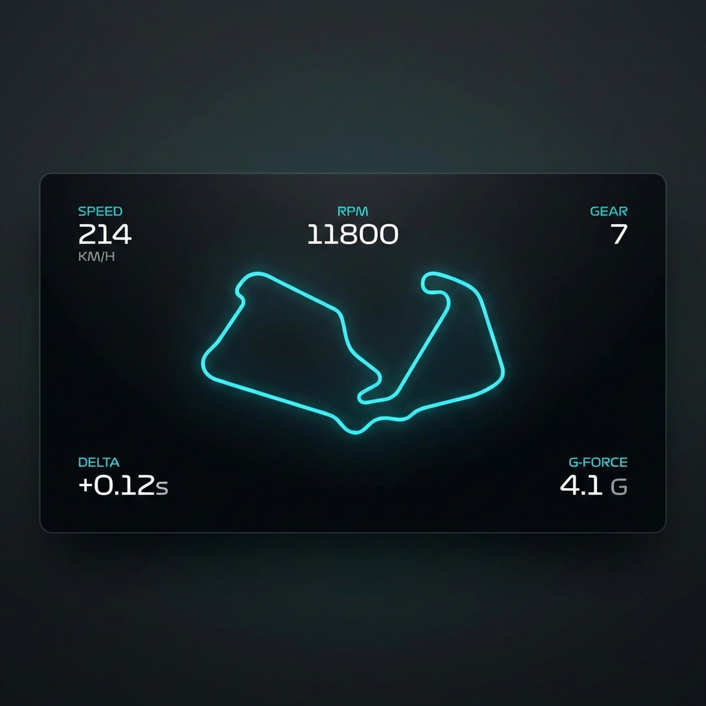
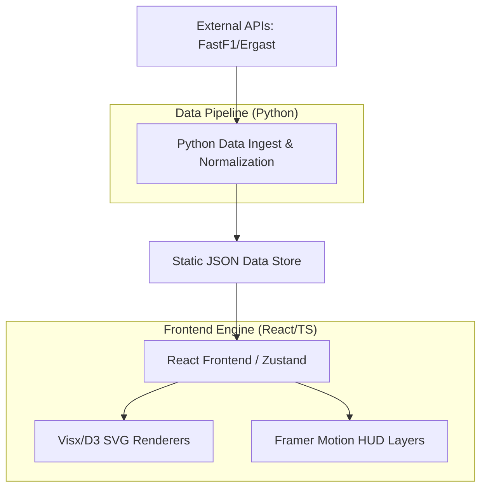

# F1 Minimal Telemetry



**A single-screen, replay-first, minimalist Formula 1 race analysis interface.**

This project visualizes race constraints, driver freedom, and decision quality—focusing on clarity, determinism, and epistemic honesty. It is a tool for strategists and data-driven F1 enthusiasts.

---

## Key Features

-   **Deterministic Replay:** Precise time control for historical race analysis with 2x, 5x, and 10x speeds.
-   **Decision-Space Visualization:** High-fidelity telemetry (Speed, RPM, Gear, Throttle/Brake) to understand driver performance.


-   **Tyre Strategy Tracking:** Visual stint timelines and tyre age monitoring.
-   **Multi-API Architecture:** Aggregates high-resolution data from FastF1, Ergast, and official timing feeds.
-   **Adaptive HUD:** Context-aware UI that switches between global race overview and focused driver tracking.


-   **Minimalist UI:** A calm, stable, non-scrollable interface built for analysis.

---

## Architecture Overview



---

## Technology Stack

-   **Frontend:** React 19, TypeScript, Zustand (State), Visx/D3 (Charts), Framer Motion (Animations)
-   **Data Processing:** Python 3.x, FastF1, Pandas
-   **Storage:** IndexedDB (Client Caching), Static JSON
-   **Build Tool:** Vite

---

## Quick Start

### 1. Prerequisites
- **Node.js**: v20+
- **Python**: v3.10+
- **FastF1**: `pip install fastf1 pandas fastapi uvicorn pydantic`

### 2. Setup & Run
```bash
# Install dependencies (syncs workspaces)
npm install --legacy-peer-deps

# Start development server (React Dashboard & Telemetry Bridge)
npm start
```

### 3. Running Specific Apps
```bash
# Start only the Frontend
npm run dev --workspace=@app/frontend

# Start only the Bridge
npm run bridge

# Run tests
npm test --workspace=@app/frontend  # Frontend (Vitest)
python -m pytest apps/bridge/tests/ # Backend (Pytest)
```

---

## Documentation

-   [Implementation History](docs/IMPLEMENTATION_HISTORY.md) - Chronological log of build steps and technical milestones.
-   [Architecture](docs/ARCHITECTURE.md) - Design philosophy and state management.
-   [Data Pipeline](docs/DATA_PIPELINE.md) - Ingestion, normalization, and optimization.
-   [Core Components](docs/CORE_COMPONENTS.md) - React component library and HUD layers.
-   [Setup Guide](docs/SETUP.md) - Environment configuration and first-run instructions.

---

## Philosophy

We prioritize **clarity over spectacle**. The UI is built to be a strategist's notebook, ensuring that every pixel represents a meaningful data point without the noise of traditional broadcasts.

---

## License

MIT License. See [LICENSE](LICENSE) for details.
