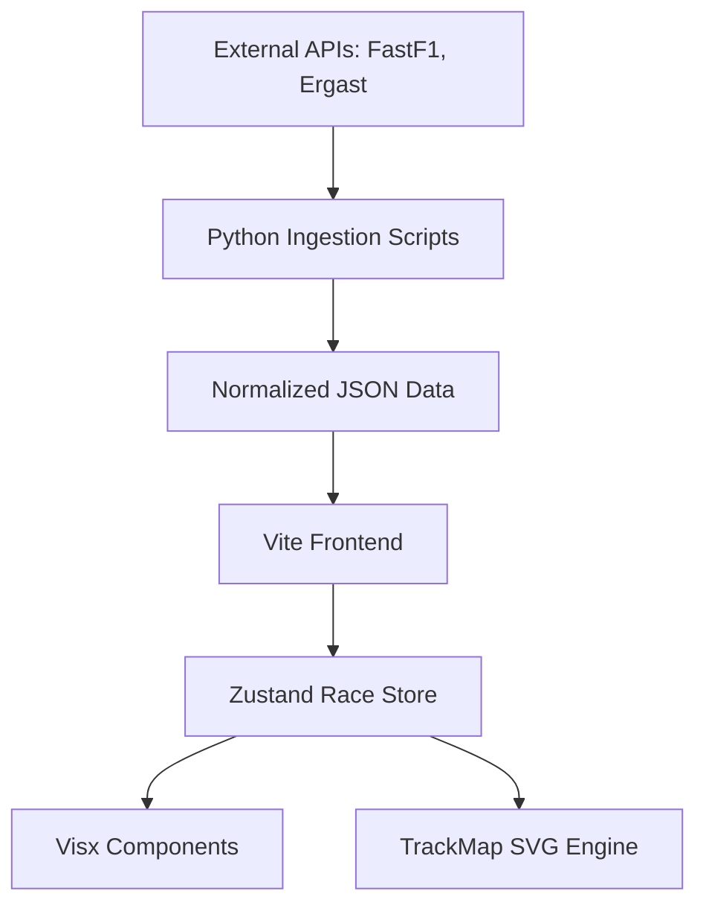

# 🏗️ Architecture Overview

This document describes the high-level architecture and design principles of the F1 Minimal Telemetry project.

## 1. System Design

The application follows a decoupled architecture, separating data ingestion (Python) from state management and rendering (React/TypeScript).

## 2. Core Principles

- **Determinism**: The UI state is a pure function of `time`. Given a timestamp `t`, the application renders a consistent state across all components.
- **Epistemic Honesty**: We do not "hallucinate" data. If telemetry is missing for a specific frame, the UI reflects that gap rather than interpolating blindly.
- **Single-Screen Stability**: The interface is designed to be stable and non-scrolling, functioning as a "cockpit" for race analysis.

## 3. Tech Stack Justification

### Frontend: React + Visx + Zustand
- **Visx**: Provided by Airbnb, Visx offers low-level visualization primitives that stay within the React lifecycle. We use it for high-performance SVG rendering of the track and telemetry charts.
- **Zustand**: A lightweight, high-frequency state management library. It handles the "Race Cursor" (current time) which updates dozens of times per second without the overhead of Redux or Context API.

### Backend: Python + FastF1
- **FastF1**: The industry-standard library for accessing F1 telemetry. Our scripts handle complex tasks like coordinate normalization and track centering before sending data to the frontend.

## 4. Data Normalization

All raw coordinates are normalized into a **0.0 to 1.0 coordinate space**. This allows the `TrackMap` component to be responsive while maintaining the exact relative geometry of the circuit.

- **Track Data**: Resampled into 500-1000 equidistant points.
- **Telemetry**: Indexed by `sessionTime` for O(1) or O(log N) lookup during playback.
