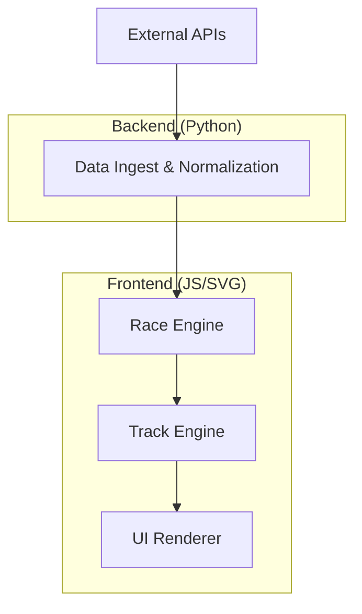

# 🏎️ F1 Minimal Telemetry

**A single-screen, replay-first, minimalist Formula 1 race intelligence interface.**

Designed for data-driven F1 enthusiasts, this project visualizes race constraints, driver freedom, and decision quality—focusing on clarity and epistemic honesty over broadcast spectacle.

---

## ✨ Key Features

-   **Deterministic Replay:** Precise time control for historical race analysis.
-   **Decision-Space Visualization:** Understand why drivers made certain moves.
-   **Multi-API Architecture:** Aggregates data from FastF1, Ergast, and more.
-   **Minimalist UI:** A calm, stable, non-scrollable interface built for analysis.

---

## 🏗️ Architecture Overview

---

## 🛠️ Technology Stack

-   **Frontend:** Vanilla JavaScript / Preact, SVG, anime.js
-   **Data Processing:** Python, FastF1, Pandas
-   **Data Format:** Static JSON / Parquet

---

## 📖 Documentation

-   [Technical Documentation](minimalist_f_1_race_intelligence_interface_technical_documentation%20(1).md) - Deep dive into architecture, data strategy, and schemas.
-   **Getting Started:** See the [Installation Guide](minimalist_f_1_race_intelligence_interface_technical_documentation%20(1).md#15-getting-started) in the technical docs.
-   **Development:** See the [Development Guide](minimalist_f_1_race_intelligence_interface_technical_documentation%20(1).md#16-development-guide).

---

## 🚀 Roadmap

-   **Phase 1:** Foundation & Static Replay (In Progress)
-   **Phase 2:** Advanced Visualization (Alpha)
-   **Phase 3:** Live Data Support (Beta)

---

## 🤝 Contributing

We prioritize **clarity, determinism, and epistemic honesty**. If you're interested in race strategy and data visualization, feel free to contribute!

1. Fork the Repo.
2. Create a Feature Branch.
3. Submit a Pull Request.

---

## ⚖️ License

MIT License - See [LICENSE](LICENSE) (TBD)
